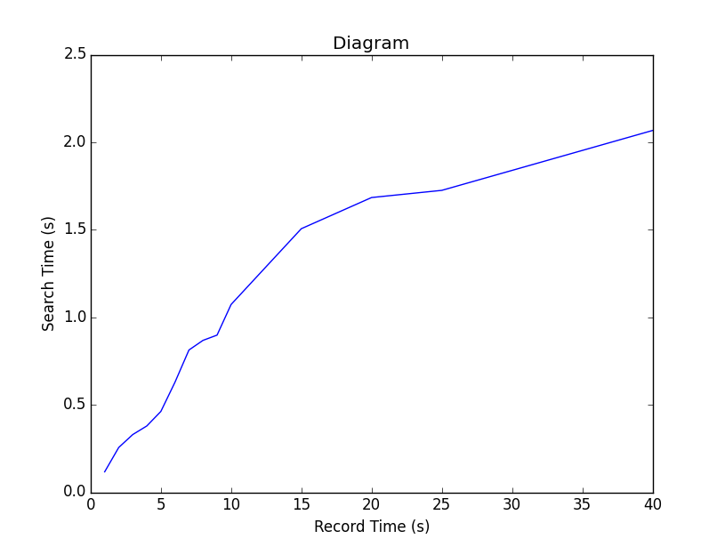
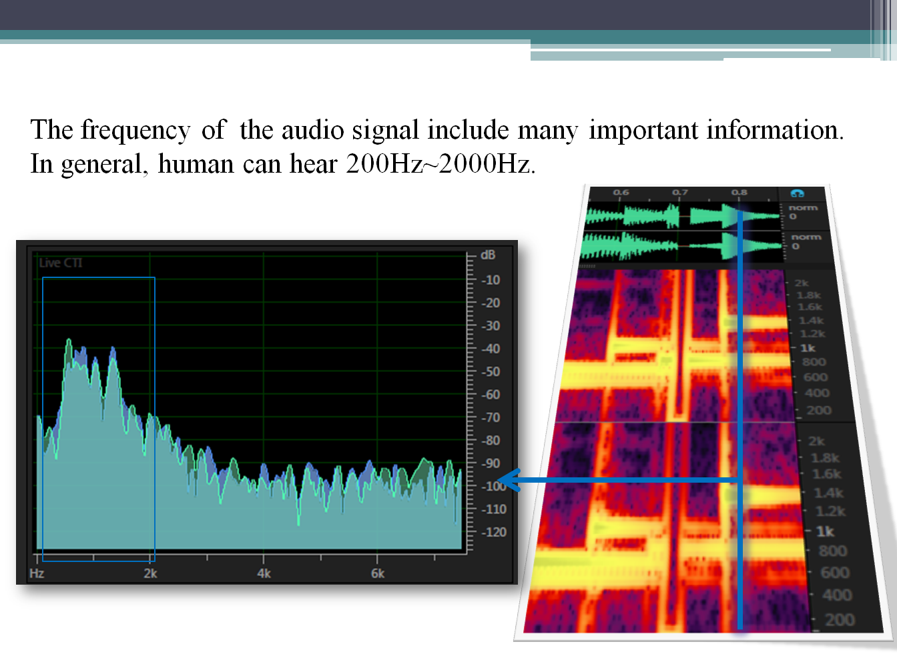
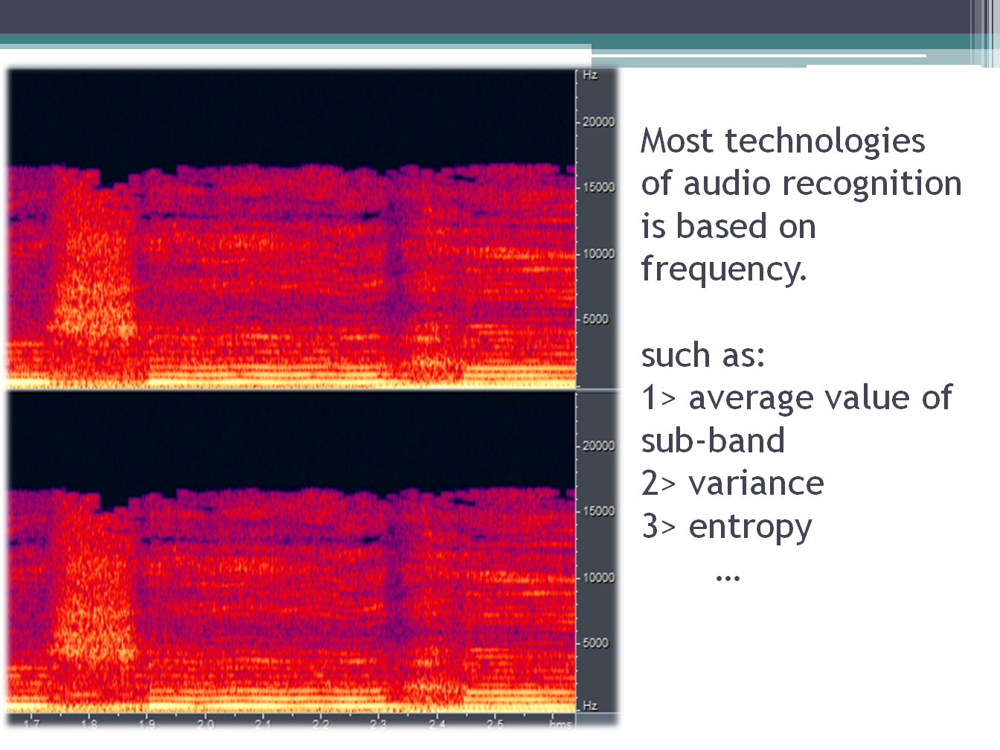
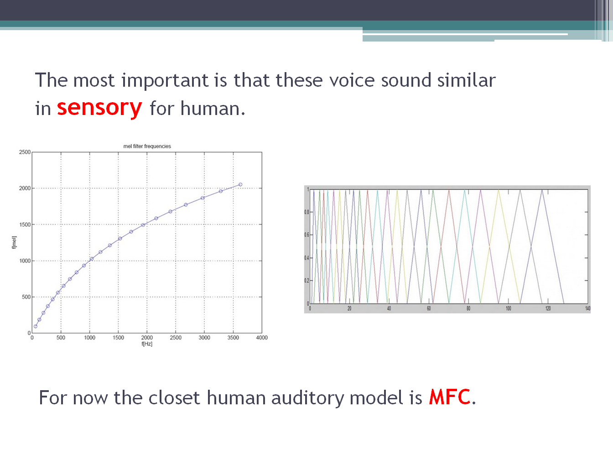
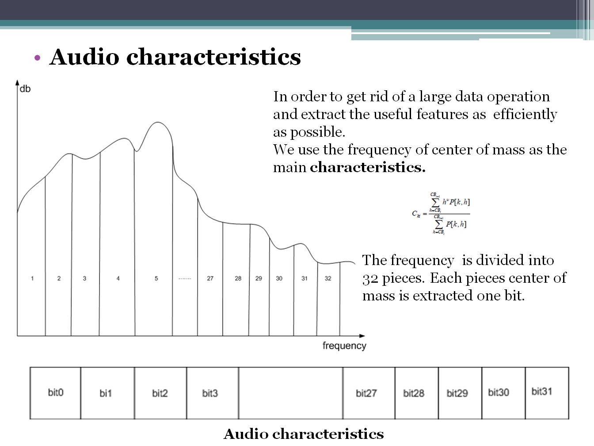
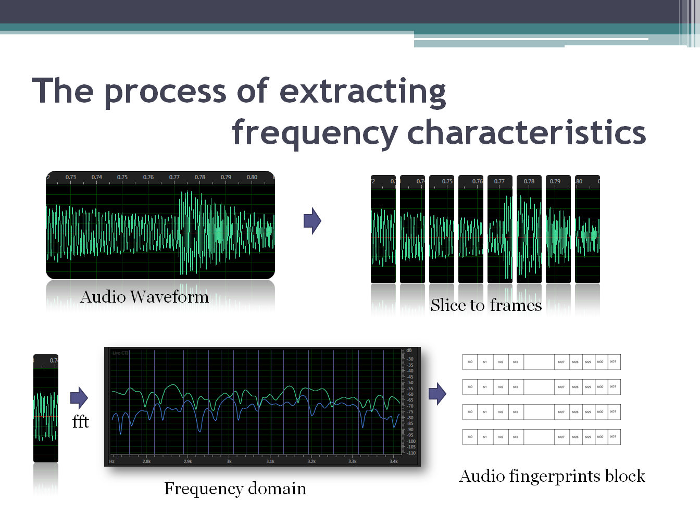
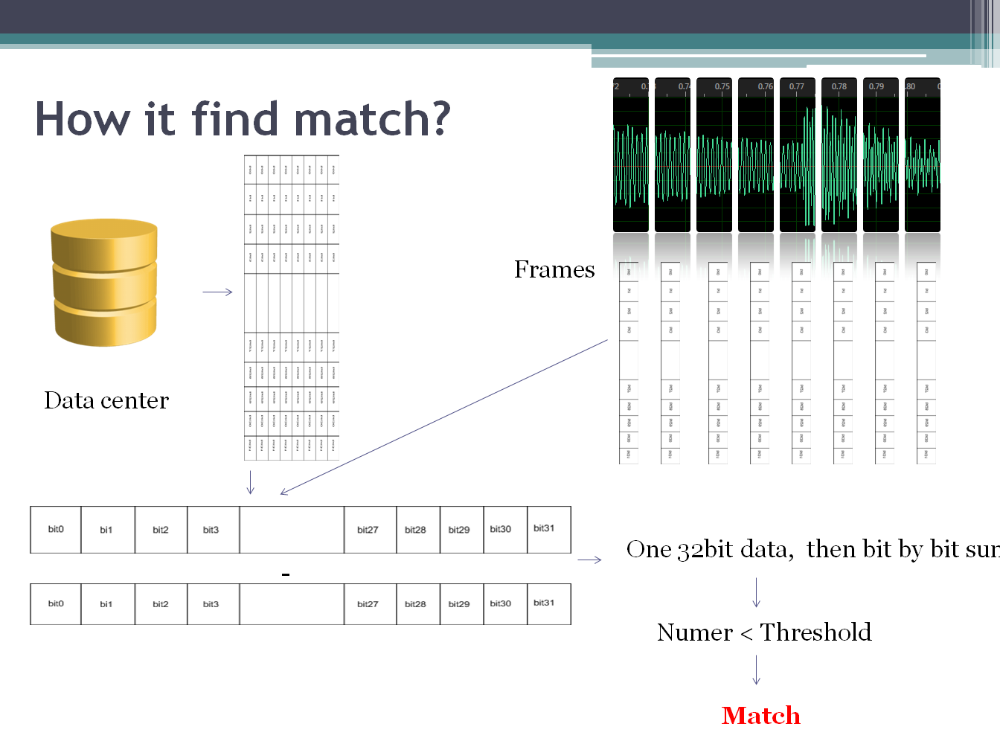

Auana-P Version 0.6


#Auana-P:Auana algorithm Python Package<br>
########################

Auana is a open source, free and light tool with the audio recognition and basic analysis algorithms. It try to provide a professional audio recognition solutions for python. <br>
It was designed by python and c(core algorithm). So it is fast enough, it can easily find the simialr references which it heared before, the progress just like human. And also it will tell the user the position where the songs is playing. 
Auana support microphone records and file analysis. File analysis only support "wav" file for now. In addition, it also provide the functions: Broken-Frame detection and Volume value detection.<br>

Except using for recognitions, it will more focus on audio signal analysis. 
At the begaining, Auana is designed for audio validition. It is so boring to check the musics/songs by manually.  
So for the automation of audio validation, it may be a good idea. It is still in developing. If you are intereted in it, welcome to contact me by Email.<br>

##Setup:
-----------------------------------
*  Firstly, install python package "numpy"    (math tool)<br>
*  Besides, install python package "pyaudio"  (audio play/record library)<br>

##Features:
-----------------------------------
>1.Broken-frame detection                                      [support]<br>
>2.Sound recognition                                           [support]<br>
>3.Volume value detection                                      [support]<br>
>4.Audio play and record                                       [support]<br>
>5.Signal noise ratio detection                                [will]<br>
>6.Support mp3 ,wma…etc                                        [will]<br>
>7.Detect noise                                                [will]<br>


##Quickly Start
-----------------------------------
1.The class Storage is a data management. 
If you want to use the recognition, you must create a storage and init it.<br>

1) Create a new storage to store the data.
The defalut framerate is 22500, data path is ../auana/data.
If you want to use the default configuration, see the following example.
```python
        try:
                Create()
        except ValueError:
                pass
```

Custom framerate.
```python
        f = 16000
        try:
                Crate(framerate=f)
        except ValueError:
                pass
```
Custom data path.
```python
        data_path = "C:/data"
        try:
                Crate(path=data_path)
        except ValueError:
                pass
```

Custom framerate and data path.
```python
        f = 16000
        data_path = "C:/data"
        try:
                Crate(framerate=f, path=data_path)
        except ValueError:
                pass
```
2) Manage the data storage functions:<br>

	query(file)
	clean_up()   #clean all items
	forget(file) #forget a file
	items()      #show all item which was saved in storage
	commit()     #commit the changes
        
        openf(file)  #open a wave file and return a WaveForm Object

2.WaveForm
WaveForm is a class that can be used to recognize or detect broken frame.

open an waveform
```python
        from auana import Storage

        sto = Storage()

	w = sto.openf("sample.wav")
```

or:

```python
	from auana import Storage
	
	sto = Storage()
	
	w = WaveForm(sto)
	
	w.write(data) #w.data=data          #data:wave data
```

1> Save the fingerprints into the storage.
```python
        w.hear()
```
2> For recognition:

```python
        name, accuracy, position = w.recognize()
```
3>For broken frame detection:
```python
        bf = w.detect_broken_frame()
```
4>Get the volume:

```python
	v = w.get_volume()
```


##Example User's Guide
-----
>1> Prework<br>
Prework Demo can memory the new files.

>2> MIC Recognition<br>
This is a Demo for showing how to recognize the data from MIC. You can double click the "Example_MICRecognition" to run.<br>
And then you can play a song and press "Enter" to make the demo to processing.

>3> File Search<br>
Drag the sample ".wav" file into "Example_FileSearchDemo.py".

>4> Broken Frame<br>
Drag the sample into "Example_BrokenFrame.py". 

##Performance
-----
There are 180 files in the "auana/data" folder. Follow figure shows the relationships between record-time and search time.




##Simple Theory
-----







##Version modification
--------------
version 0.1.Auana Pacage. <br>
version 0.2.Auana: designed by C and python.<br>
version 0.3.Auana: Optimzie parameter about recognition to make it more reliable.<br>
version 0.4.Auana: New functions: return where the match songs is playing.<br>
version 0.5.Auana: Optimize the get_fingerprint algoritms<br>
version 0.6.Auana: New algorithm for extracting fingerprints<br>
